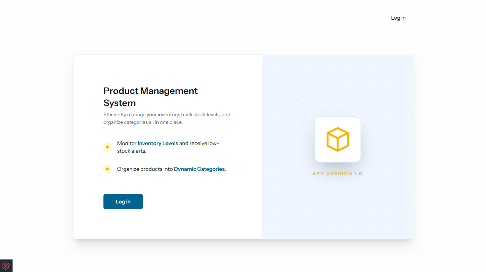
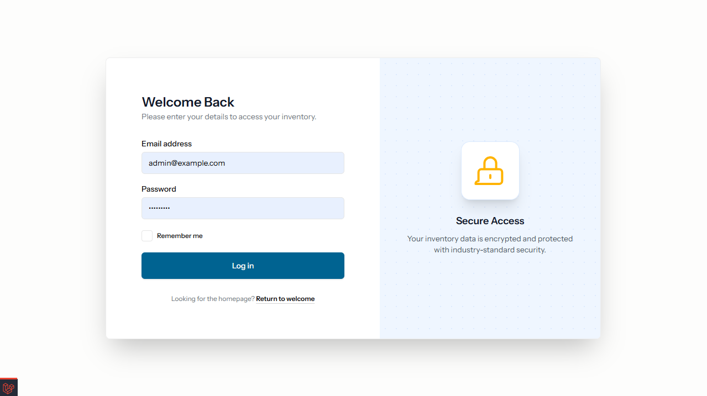
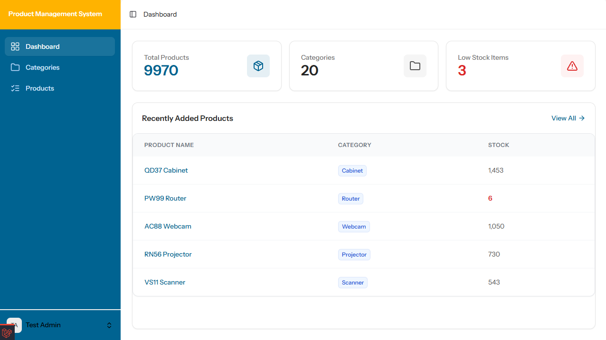
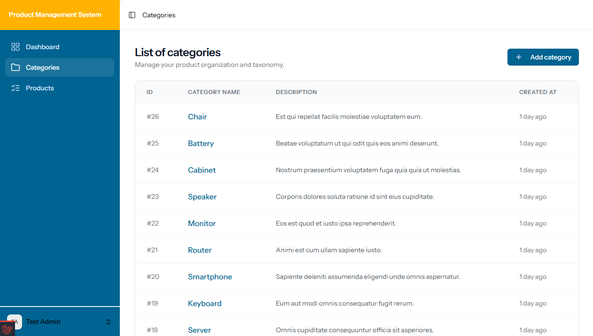
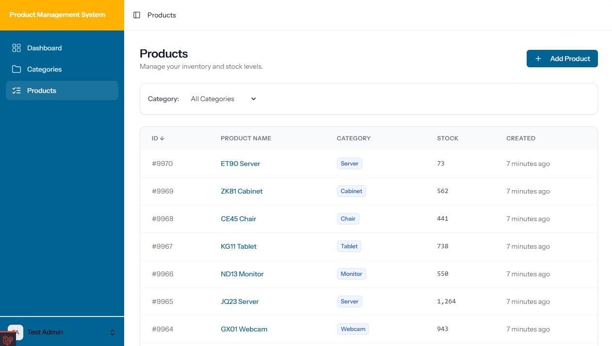
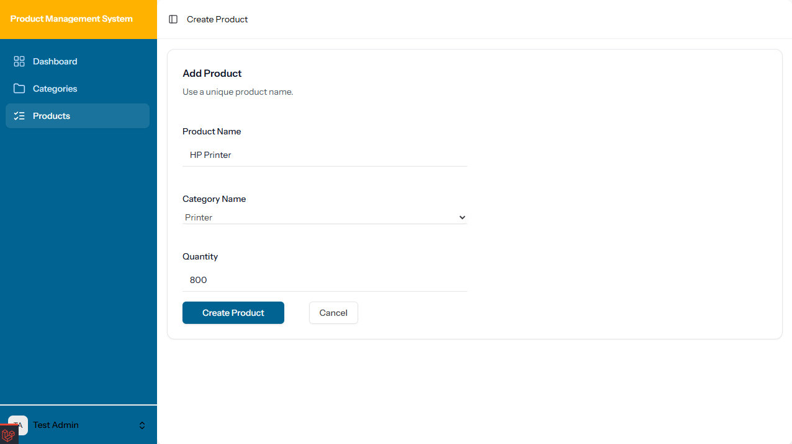

# Product Management System

## Overview
This project is a technical assessment designed to evaluate proficiency in modern full-stack development. It implements a robust **Product Management System** capable of handling inventory across various categories with real-time validation and dynamic filtering.

## Key Features
* **CRUD Operations:** Full management of Products and Categories.
* **Relational Mapping:** Strict database relationships between products and their parent categories.
* **Advanced Filtering:** Server-side pagination, sorting, and category-based filtering using Inertia.js.
* **UX/UI:** A responsive dashboard built with a custom "Brand Blue" theme and etc

## Technical Stack
* **Framework:** Laravel 12.x
* **Frontend:** Vue 3 (Composition API) with Inertia.js
* **Styling:** Tailwind CSS
* **Database:** SQLite (Zero-config required)

## System Preview
| Feature | Interface Preview |
| :--- | :--- |
| **Welcome** |  |
| **Login** |  |
| **Dashboard** |  |
| **List of Categories** |  |
| **List of Products** |  |
| **Add Product** |  |

## Requirement

- PHP 8.2
- Composer 2.8.4
- Node 22.12.0

## Installation

Clone project

    git clone https://github.com/amirhamzan/product-management-software.git  

To install project

    composer install  

Copy .env.example as .env. **Setup** all MySQL, Redis in .env

    cp .env.example .env 

Install node modules dependencies  

    npm install

  
Generate app key  

    php artisan key:generate  

Migrate all tables  

    php artisan migrate --seed

  
## Run Application

To start the development environment, run the following commands in separate terminal windows:

Start Laravel server
    
    php artisan serve    
    
Start Vite development server
    
    npm run dev

## Demo Credentials

Once the app is running and seeded, you can log in with:

Email

    admin@example.com

Password

    admin@123
